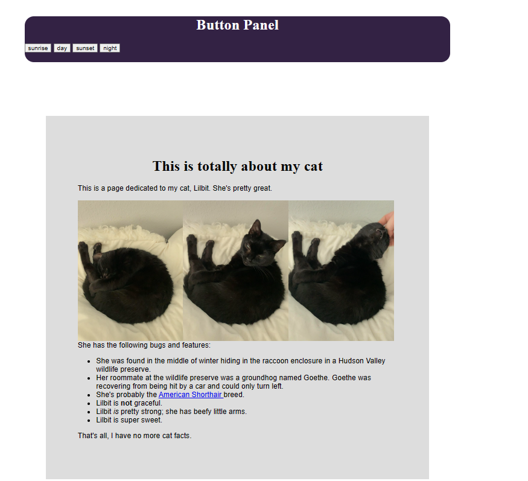

# ISC-250 Programming Through Mobile App Development
## Unit 4 Lab-Branching 
The goal of this lab is to get a working understanding of how boolean values, branching, and control flow work in JavaScript.
### Automatic class-shifting logic
This page uses a script to automatically select a theme in the form of a CSS class applied to the body as the page is loaded. 

### Mover platform
This page displays an image that moves with a mouse move event in the direction of the  arrows
